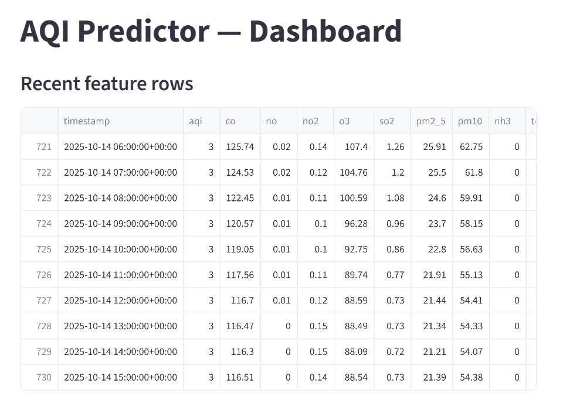
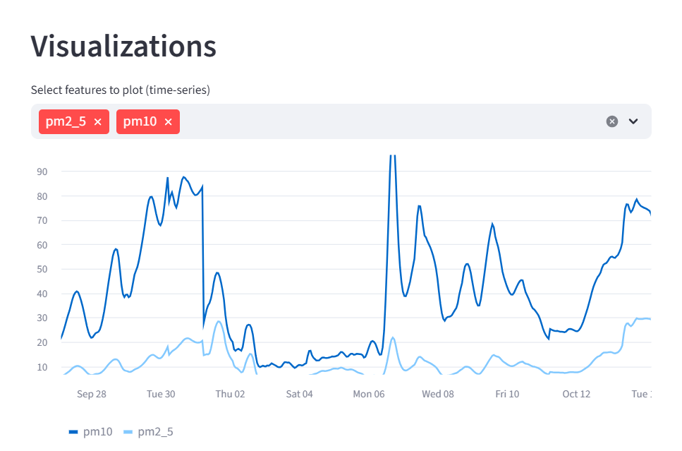
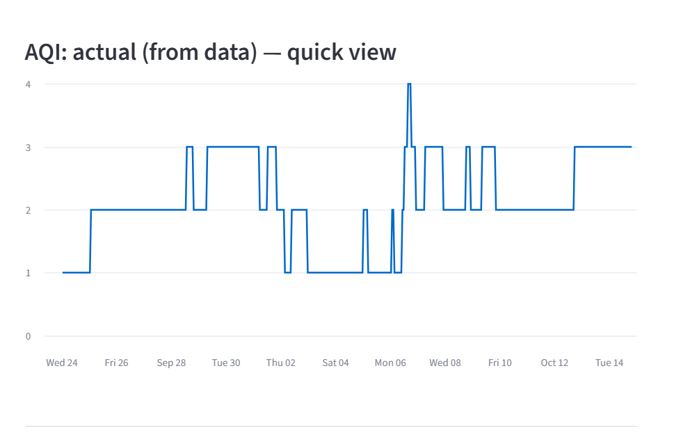
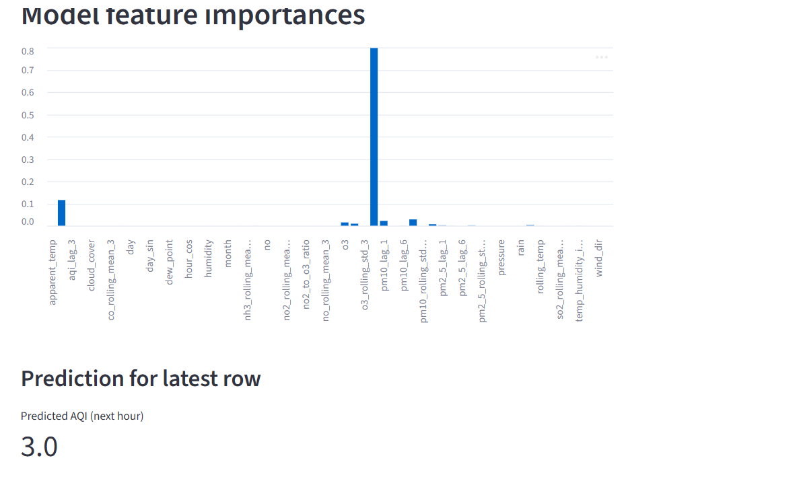

# Pearls AQI Predictor

A local-first project for 10 Peals Shine Program that trains a model to predict Air Quality Index (AQI) related targets from engineered features, exposes a prediction API, and provides simple frontends for exploration and demo (Streamlit). The codebase is structured to work locally and to be adaptable to production (feature store, CI scheduled retraining, and containerization).

## Visuals 

Below are a few visual artifacts related to this project. Update captions as needed to better describe each image.

- Figure 1 — Overview or dataset snapshot
	

- Figure 2 — Feature importance or EDA plot
	

- Figure 3 — Model evaluation (confusion matrix / residuals / predictions)
	

- Figure 4 — Streamlit demo or UI screenshot
	

## Quick summary

- Purpose: Train an ML model that predicts AQI-related target(s) from weather and pollutant features, and provide a lightweight API + UI for inference.
- Main components: data ingestion/feature engineering, training pipeline, FastAPI prediction service, Streamlit demo UI.
- Intended users: data scientists experimenting locally, ML engineers preparing a small model service for deployment.

## Contract

- Inputs: JSON or CSV rows containing the feature set documented in `feature_columns.json`.
- Output: Predicted AQI (or related target) as a numeric value and optional metadata (model version, timestamp).
- Error modes: missing features or mismatched feature ordering will return clear errors. Always send the same features and order used at training.

## Repo layout 

- `train.py` — training script. Loads features, trains a scikit-learn model (RandomForest or similar), serializes `model.pkl` and `feature_columns.json`.
- `feature_engineering.py` — code for transforming raw inputs into model features; used by training and by the API.
- `features_data.csv` — sample/seed dataset used locally when feature store is not configured.
- `raw_ingestion.py` / `weather_ingestion.py` (in `script/`) — optional ingestion helpers for raw data collection.
- `app/api.py` — FastAPI app exposing prediction endpoints.
- `app/streamlit_app.py` — interactive Streamlit demo that loads the model locally and shows predictions.
- `feature_columns.json` — list/ordering of features the model expects. Keep this with the model.
- `.github/workflows/daily_training.yml` — scheduled CI workflow that retrains the model periodically (CI config).

## Feature engineering & model contract

- The training pipeline writes `feature_columns.json` with the exact feature names and order used by the model. The API and any frontend must use the same ordering.
- If you change feature engineering, make sure to re-run `train.py` and distribute the new `model.pkl` and `feature_columns.json` together.

## Model performance

- During development the RandomForest model achieved 98% accuracy on the validation/test split used for evaluation. Keep in mind that this number depends on the dataset, preprocessing, and the exact train/validation split; if you change feature engineering or add new data you should re-evaluate and report updated metrics (accuracy, RMSE, MAE or other relevant metrics for your target).

## Design decision — use of Air Pollution Quality Index API

- A deliberate design choice in this project was to rely primarily on the Air Pollution Quality Index (AQI) API for input signals. After experimenting and analyzing feature importance and model performance, I found that pollutant-based AQI data provided sufficient predictive signal for the target; adding a separate weather API did not produce meaningful improvements in our experiments.
- This approach reduces external dependencies, simplifies ingestion, and lowers latency. I discussed these findings with my mentor Ahmed and, based on those results and our domain discussion, proceeded with the AQI-only design. If desired, the repository is set up so you can add weather features later and run ablation/feature-addition studies to quantify any incremental benefit.

I have discussed my finding with my pearl Mentor Ahmed.

## Setup (Windows PowerShell)

1) Create and activate a virtual environment (PowerShell):

```powershell
python -m venv .venv; .\.venv\Scripts\Activate.ps1
pip install -r requirements.txt
```

2) (Optional) If you plan to use the feature store or other remote services, configure credentials via environment variables. See the code comments in `train.py` for which env vars are read.

## Local workflow — train / serve / demo

1) Train the model (local CSV fallback):

```powershell
python train.py
```

This will create at least:

- `model.pkl` — serialized model (pickle)
- `feature_columns.json` — JSON array of features and ordering

2) Run the FastAPI service (from project root):

```powershell
uvicorn app.api:app --reload --port 8000
```

Endpoints:

- `GET /health` — simple health check
- `GET /predict/latest` — predict using the latest row from `features_data.csv` (quick demo)
- `POST /predict` — body: {"features": {"feature_name": value, ...}}; returns prediction and metadata

Example POST (PowerShell):

```powershell
$body = '{"features": {"pm2_5": 12.3, "temperature": 28.5, "humidity": 55}}'
Invoke-RestMethod -Uri http://127.0.0.1:8000/predict -Method Post -Body $body -ContentType 'application/json'
```

3) Run the Streamlit demo (loads model locally):

```powershell
streamlit run app/streamlit_app.py
```

The Streamlit app is a fast way to explore recent rows and run single predictions without calling the API. For production separation, convert the UI to call the API instead of loading `model.pkl` directly.

## CI / scheduled retraining

- `.github/workflows/daily_training.yml` is configured to run scheduled training (daily). The action runs `train.py`, saves artifacts, and can be extended to publish model artifacts to a model registry or cloud storage.

## Data handling & privacy

- `features_data.csv` contains sample data for local development. If your real data contains PII or sensitive information, do not commit it to the repo. Use secure storage and environment-specific configs.

## Tests and validation

- There are no formal unit tests included by default. Recommended minimal tests:
	- A unit test to verify `feature_engineering.py` transforms produce expected columns.
	- A simple integration test to call `POST /predict` with expected input and assert output shape.

## Troubleshooting / common issues

- Missing `feature_columns.json` or mismatch: retrain using `python train.py` to regenerate the file.
- Model file load errors (pickle): ensure Python and library versions are compatible with the environment used to save the model.
- Port conflicts for API: change the port in the `uvicorn` command.

## Development notes & future improvements

- Convert the model artifact format to ONNX or a more portable format for cross-language serving.
- Add a tests folder with pytest tests for feature engineering and API endpoints.
- Add Dockerfiles for model service and UI for easier deployment.
- Add API authentication and rate limiting for production readiness.

## Files of interest

- `train.py` — orchestrates data load, feature engineering, training, and model export.
- `feature_engineering.py` — feature transforms used for training and inference.
- `features_data.csv` — local sample dataset used by training and demos.
- `app/api.py` — FastAPI prediction service.
- `app/streamlit_app.py` — demo UI for interactive exploration.
- `.github/workflows/daily_training.yml` — scheduled retrain workflow.


## Quick completion summary

- Train: `python train.py`
- Serve: `uvicorn app.api:app --reload --port 8000`
- Demo: `streamlit run app/streamlit_app.py`

If you'd like, I can also:
- add a small pytest suite for feature engineering and API sanity checks, or
- create a `Makefile` / `scripts/` folder with common commands.

Enjoy exploring AQI predictions!
